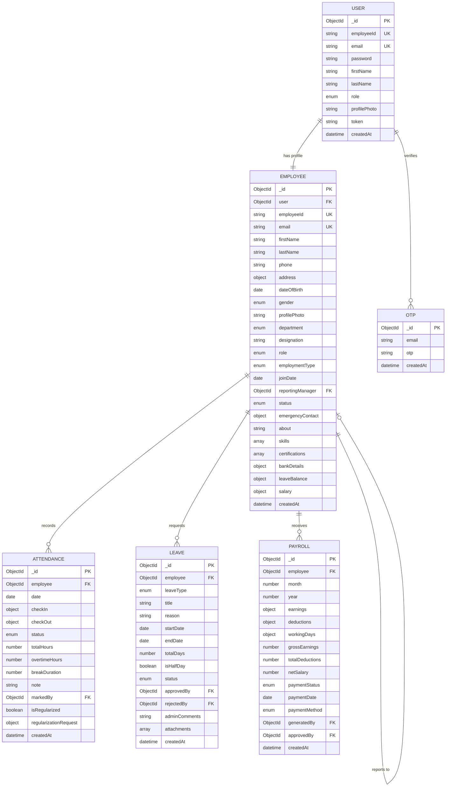

<h1 align="center">
  ⚡ Dayflow — HR Management System
</h1>

<p align="center">
  <strong>A comprehensive, modern Human Resource Management System built with the MERN stack</strong>
</p>

<p align="center">
  
  
  
  
  
</p>

---

## 🎯 Overview

Dayflow is a full-featured HR Management System designed to streamline workforce administration. From employee onboarding to payroll processing, it provides HR teams and administrators with powerful tools to manage their organization efficiently.

### Why Dayflow?

- 🚀 **Modern Stack** — Built with React 19, Express 4, and MongoDB for optimal performance
- 🔐 **Secure** — JWT-based authentication with role-based access control
- 📊 **Data-Driven** — Rich analytics dashboard with interactive visualizations
- 📧 **Automated** — Scheduled email notifications for birthdays, anniversaries, and alerts
- 🎨 **Beautiful UI** — Clean, responsive interface built with TailwindCSS

---

## ✨ Features

### 👥 Employee Management
- Complete employee profiles with personal, professional, and financial information
- Skills, certifications, and work experience tracking
- Resume/CV management with document uploads
- Emergency contact information
- Department and job position management

### ⏰ Attendance Tracking
- Real-time check-in/check-out system
- Multiple attendance methods (web, biometric, manual)
- Overtime calculation with automatic hours tracking
- Attendance regularization requests with approval workflow
- Late arrival and early departure detection

### 🌴 Leave Management
- **10+ Leave Types**: Vacation, Sick, Personal, Casual, Maternity, Paternity, Bereavement, and more
- Leave balance tracking per employee
- Half-day leave support
- Approval workflow with HR/Admin authorization
- Leave overlap detection
- Email notifications for leave requests and decisions

### 💰 Payroll System
- Comprehensive salary structure with components:
  - Basic Salary, HRA, Conveyance, LTA, Fixed Allowance
  - Provident Fund (Employee & Employer contributions)
  - Professional Tax deductions
- Automatic salary calculations
- Monthly payroll generation
- Payment tracking (pending, processed, paid)
- Multiple payment methods support

### 📈 Analytics Dashboard
- Employee statistics and trends
- Department-wise distribution
- Attendance heatmaps
- Leave analytics
- Interactive charts powered by Recharts

### 📧 Automated Notifications
- 🎂 Birthday wishes
- 🎉 Work anniversary celebrations
- ⚠️ Missed checkout alerts
- 📝 Leave request notifications
- ✅ Leave approval/rejection emails

### 🛡️ Role-Based Access Control
| Role | Capabilities |
|------|-------------|
| **Admin** | Full system access, employee management, payroll, analytics |
| **HR** | Employee directory, attendance, leave management, reports |
| **Employee** | Personal profile, attendance, leave requests, payslips |

---

## 🏗️ Architecture

```

## Deployment

The project deploys as two services:

1. Deploy `client` to Vercel.
2. Deploy `server` to a Node.js host such as Render or Railway. The API needs a persistent MongoDB connection and cannot run as a static Vercel site.

### Vercel client settings

- **Root Directory:** `client`
- **Build Command:** `npm run build`
- **Output Directory:** `dist`
- **Environment Variable:** `VITE_API_BASE_URL=https://YOUR-BACKEND-DOMAIN/api`

The `client/vercel.json` file contains the SPA fallback needed by React Router.

### Backend environment variables

Configure these on the backend host:

```env
PORT=4000
MONGODB_URL=your-mongodb-connection-string
JWT_SECRET=your-long-random-secret
FRONTEND_URL=https://your-project.vercel.app
MAIL_HOST=smtp.gmail.com
SMTP_PORT=587
MAIL_USER=your-email
MAIL_PASS=your-app-password
```

After deploying the backend, verify `https://YOUR-BACKEND-DOMAIN/api/health`, then set the resulting `/api` URL as `VITE_API_BASE_URL` in Vercel and redeploy the client.
HR_Management_System_Odoo/
├── client/                    # React Frontend
│   ├── src/
│   │   ├── components/        # Reusable UI components
│   │   │   ├── auth/          # Authentication forms
│   │   │   ├── dashboard/     # Dashboard layouts
│   │   │   ├── guards/        # Route protection
│   │   │   ├── layout/        # Page layouts
│   │   │   ├── profile/       # Profile components
│   │   │   ├── salary/        # Payroll components
│   │   │   └── ui/            # Base UI components
│   │   ├── pages/             # Page components
│   │   │   ├── admin/         # Admin pages
│   │   │   └── employee/      # Employee pages
│   │   ├── context/           # React Context (Auth)
│   │   └── services/          # API services
│   └── tailwind.config.js     # TailwindCSS configuration
│
└── server/                    # Express Backend
    ├── config/                # Database configuration
    ├── controllers/           # Request handlers
    ├── middleware/            # Auth middleware
    ├── models/                # MongoDB schemas
    │   ├── Employee.js        # Employee model
    │   ├── Attendance.js      # Attendance records
    │   ├── Leave.js           # Leave requests
    │   ├── Payroll.js         # Payroll records
    │   └── User.js            # User authentication
    ├── routes/                # API routes
    ├── mail/                  # Email service & templates
    ├── utils/                 # Scheduler & utilities
    └── services/              # Business logic
```

---

## Database Schema



---

## 🚀 Quick Start

### Prerequisites

- **Node.js** 18+ 
- **MongoDB** (local or Atlas)
- **npm** or **yarn**

### Installation

1. **Clone the repository**
   ```bash
   git clone https://github.com/yourusername/HR_Management_System_Odoo.git
   cd HR_Management_System_Odoo
   ```

2. **Backend Setup**
   ```bash
   cd server
   npm install
   ```
   
   Create a `.env` file:
   ```env
   PORT=4000
   MONGODB_URI=mongodb://localhost:27017/dayflow
   JWT_SECRET=your_super_secret_key
   
   # Email Configuration
   SMTP_HOST=smtp.gmail.com
   SMTP_PORT=587
   SMTP_USER=your_email@gmail.com
   SMTP_PASS=your_app_password
   ```

3. **Frontend Setup**
   ```bash
   cd ../client
   npm install
   ```

4. **Seed the Database** (Optional)
   ```bash
   cd ../server
   node seed.js
   ```

5. **Start Development Servers**
   
   **Backend:**
   ```bash
   cd server
   npm run dev
   ```
   
   **Frontend:**
   ```bash
   cd client
   npm run dev
   ```

6. **Access the Application**
   - Frontend: `http://localhost:5173`
   - Backend API: `http://localhost:4000`

---

## 🔌 API Endpoints

| Module | Endpoints |
|--------|-----------|
| **Auth** | `POST /api/auth/signup`, `/signin`, `/verify-otp`, `/forgot-password` |
| **Employees** | `GET/POST /api/employees`, `GET/PUT /api/employees/:id` |
| **Attendance** | `POST /api/attendance/check-in`, `/check-out`, `GET /api/attendance/history` |
| **Leaves** | `GET/POST /api/leaves`, `PUT /api/leaves/:id/approve`, `/reject` |
| **Payroll** | `GET /api/payroll/:employeeId`, `POST /api/payroll/generate` |

---

## 🛠️ Tech Stack

### Frontend
| Technology | Purpose |
|------------|---------|
| React 19 | UI Framework |
| React Router 7 | Client-side routing |
| TailwindCSS 3 | Styling |
| Recharts | Data visualization |
| Heroicons | Icons |
| date-fns | Date manipulation |
| Vite | Build tool |

### Backend
| Technology | Purpose |
|------------|---------|
| Express 4 | Web framework |
| MongoDB + Mongoose | Database |
| JWT | Authentication |
| bcrypt | Password hashing |
| Nodemailer | Email service |
| node-cron | Scheduled tasks |

---

## 📱 Key Pages

| Page | Description |
|------|-------------|
| **Admin Dashboard** | Organization overview, employee stats, quick actions |
| **Employee Directory** | Searchable list of all employees |
| **My Profile** | Personal profile with editable information |
| **Attendance** | Check-in/out, history, regularization requests |
| **Time Off** | Leave requests, balance, approval status |
| **Analytics** | Charts, heatmaps, department breakdowns |

---

## 🤝 Contributing

Contributions are welcome! Please feel free to submit a Pull Request.

1. Fork the repository
2. Create your feature branch (`git checkout -b feature/AmazingFeature`)
3. Commit your changes (`git commit -m 'Add some AmazingFeature'`)
4. Push to the branch (`git push origin feature/AmazingFeature`)
5. Open a Pull Request

---


